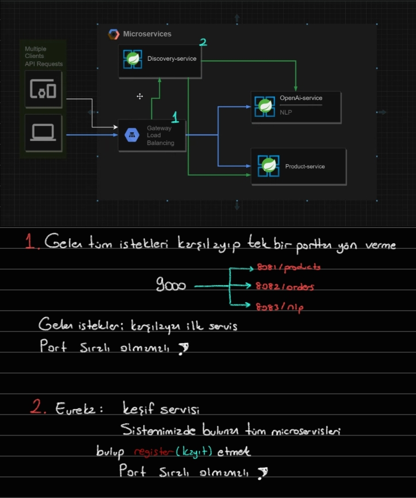

# Microservice App



- discovery-service || register-service

## Microservice Advantages

- Her seyi kendi icinde barindirmiyor `monolitik` gibi icerisinde bircok microservice barindirir

- Buyuk projeleri kucuk projelere bolme

- Kucuk bagimsiz servisler

- Islevsellik

- Bagimsiz gelistirme

  - Bir servis patlasa bile diger servisler kullanilmaya devam edicek

- Tek bir hata programi patlatmaz

- Yeniden kullanilabilirlik

  - monolitik bir projeyi direk microservis projesine entegre edebiliriz

- CI/CD hizlandirma

## Microservice Disadvantages

- Bir cok kucuk servisi yonetmek zor olabilir


---

---

### product-service

1.

```xml
<dependency>
	<groupId>org.springframework.cloud</groupId>
	<artifactId>spring-cloud-starter-netflix-eureka-client</artifactId>
</dependency>
```

<br>

2.

```yml
server:
  port: 8081

# Discovery servisin microservicelerin isimleriyle taniyip kayit etmesi icin
# Eureka'ya tanitmak icin
# Discovery servis gorsun diye
spring:
  application:
    name: product-service

# Eureka Config
eureka:
  client:
    service-url:
      # Eureka portu verilmeli
      defaultZone: http://localhost:8912/eureka
```

3.

```java
@SpringBootApplication
@EnableDiscoveryClient
public class ProductServiceApplication {

	public static void main(String[] args) {
		SpringApplication.run(ProductServiceApplication.class, args);
	}

}
```

---

### discovery-service || registery-service

- Diger servisleri bulacak kesif servisi

- cok fazla kod yazilmaz, configurasyonlar yapilir

1.

```xml
<dependency>
	<groupId>org.springframework.cloud</groupId>
	<artifactId>spring-cloud-starter-netflix-eureka-server</artifactId>
</dependency>
```

2.

```yml
server:
  port: 8912

spring:
  application:
    name: discovery-service
eureka:
  instance:
    hostname: localhost
  client:
    # Kesif servisi oldugu icin kendini kesfetmene gerek yok, sen server'sin
    register-with-eureka: false
    # Kendini alma
    fetch-registry: false
    service-url:
      #Nerede calisacak
      #http://localhost:8912 calisiyor
      defaultZone: http://${eureka.instance.hostname}:${server.port}/eureka/
```

3.

```java
@SpringBootApplication
//Bu bir kesif servisidir demek icin kullanilir
@EnableEurekaServer
public class DiscoveryServiceApplication {

	public static void main(String[] args) {
		SpringApplication.run(DiscoveryServiceApplication.class, args);
	}

}
```

---

### api-gateway

- Tek bir port'dan cikis verme

- Normal bir service gibi eureka'ya tanitmaliyiz

1.

```xml
<dependency>
	<groupId>org.springframework.cloud</groupId>
	<artifactId>spring-cloud-starter-gateway</artifactId>
</dependency>
<dependency>
	<groupId>org.springframework.cloud</groupId>
	<artifactId>spring-cloud-starter-netflix-eureka-client</artifactId>
</dependency>
```

2.

```yml
server:
  port: 9001

spring:
  application:
    name: api-gateway

# Eureka Config
eureka:
  client:
    register-with-eureka: true
    fetch-registry: true
    service-url:
      defaultZone: http://localhost:8912/eureka
  instance:
    prefer-ip-address: true
#logging:
#  level:
#    org.springframework.cloud.gateway: DEBUG
```

3.

```md
config
|
->GatewayConfig.java
```

```java
@Configuration
public class GatewayConfig {

    //RouteLocator -->  Yönlendirme konfigürasyonu icin kullanilir
    @Bean
    public RouteLocator customRouteLocation(RouteLocatorBuilder routeLocatorBuilder) {
        return routeLocatorBuilder
        // routes --> yeni yönlendirme kuralları eklemek için kullanılır
        .routes()
                //.route("product-service-route", r ->: Bu satır, "product-service-route" adında bir yönlendirme tanımlar. Bu yönlendirme, "/product-service/**" yoluyla gelen istekleri işleyecektir.
                .route("product-service-route", r ->
                        //r.path("/product-service/**"): Bu satır, yolu belirler. Yani, bu yönlendirme "/product-service/**" yolu üzerindeki istekleri ele alacaktır. /** joker karakteri, tüm alt yolları da içerecektir.
                        r.path("/product-service/**")
                                //.filters(f -> f.rewritePath("/product-service/(?<segment>.*)", "/${segment}")): Bu satır, isteğin yolu üzerinde bir dönüşüm yapılmasını sağlar. Burada, /product-service/ sonrasındaki tüm bölümleri yakalar ve uri("lb://product-service") satırında kullanılmak üzere ${segment} olarak ayarlar.
                                .filters(f -> f.rewritePath("/product-service/(?<segment>.*)", "/${segment}"))
                                // eureka bunu bildigi icin oradan cekiyoruz
                                //.uri("lb://product-service"): Bu satır, işlenmiş isteği yönlendireceği hedef URI'yi belirler. lb://product-service, Eureka tarafından sağlanan yük dengeleyici (load balancer) hedefini ifade eder. Yani, "product-service" adındaki servis, yük dengeleyici üzerinden hedeflenir.
                                .uri("lb://product-service")
                )
                .route("order-service-route", r ->
                        r.path("/order-service/**")
                                .filters(f -> f.rewritePath("/order-service/(?<segment>.*)", "/${segment}"))
                                // eureka bunu bildigi icin oradan cekiyoruz
                                .uri("lb://order-service")
                )
                .build();
    }

}

```

4.

```java
@SpringBootApplication
@EnableDiscoveryClient
public class ApiGatewayApplication {

	public static void main(String[] args) {
		SpringApplication.run(ApiGatewayApplication.class, args);
	}

}
```


